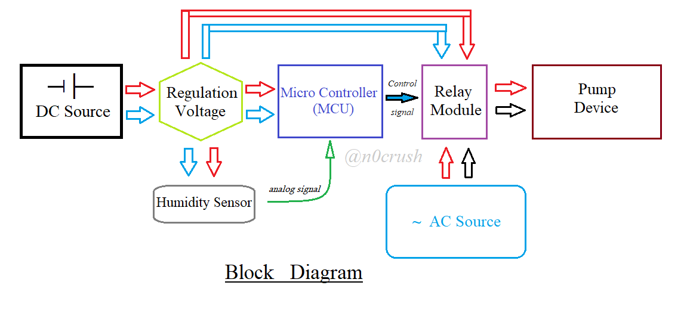
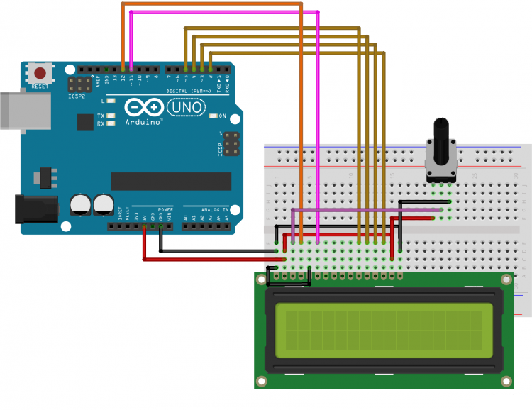
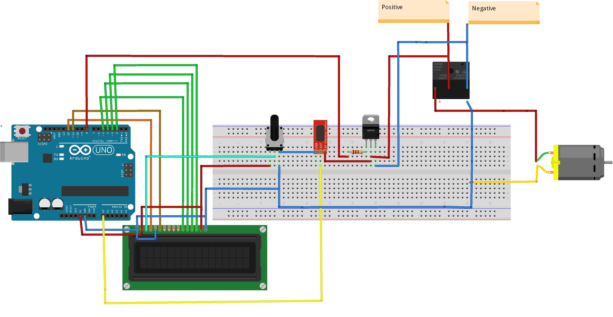

# How does it works?
- ***First***,  the ***humidity sensor*** receives ***humidity value***.
- **THEN** sends ***signals*** to ***MCU*** processes, compares with the ***specified value***.
- **THEN** sends the ***output signal*** to the ***relay module.***
- **THEN terminal.**
> see [Block Diagram](./media/block_diagram.PNG)
# Setting it up
- **First imagin about it:**

- **Test your LCD:**

- **Connect components:**

**_Note_**:

\- Can use phototransistor to isolate the source for MCU to be more safe.

\- [Use a diode](./media/discharge_for_relay_coil.png) to discharge power for the relay coil.

\- Can use [Kalma filter](https://en.wikipedia.org/wiki/Kalman_filter) to filter.

# How dose it look like?

